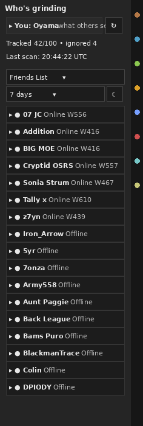
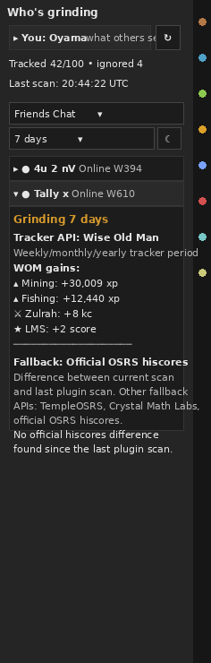

# Who's Grinding Panel

A RuneLite external plugin that helps you see **what your friends, friends-chat members, and clanmates have been grinding** without leaving the sidebar.

The plugin discovers players from RuneLite social sources, shows them in a compact list, and expands any player into an inline grinding card with XP/KC/score gains from tracker APIs and fallback hiscore scans.

## Screenshots

### Social-source list



The panel stays inside RuneLite's default sidebar width. Use the source dropdown to switch between Friends Chat, Friends List, and Clan Chat. The current player row is always available at the top, with the refresh button separated by a small gap.

### Expanded player card



Clicking a player opens a grinding-only card. The card uses as much vertical space as needed while staying within the sidebar width, so every positive tracked gain can be shown line-by-line.

## What it does

- Discovers players from enabled RuneLite social sources:
  - Friends list
  - Friends chat
  - Clan chat / clan channel
- Shows a compact player list with online/offline state and world when available.
- Keeps the logged-in player visible at the top so you can see what others can see for your own account.
- Lets you refresh social sources with the `↻` button next to the current-player row.
- Lets you switch the visible source directly in the panel.
- Lets you choose the lookback window directly in the panel:
  - Day
  - 7 days
  - 30 days
  - 365 days
- Lets you toggle offline friends from the panel checkbox next to the lookback dropdown.
- Removes cached offline friend rows immediately when the offline checkbox is turned off.
- Expands a clicked player inline to show what they have been grinding.
- Shows **all positive tracked changes**, not just a top-four summary.
- Groups gains into clear sections:
  - Skills — XP gains
  - Bosses — KC gains
  - Activities — score/minigame gains
- Cleans up common OSRS labels, for example:
  - `chambers_of_xeric` -> `CoX`
  - `tombs_of_amascut` -> `ToA`
  - `theatre_of_blood` -> `ToB`
  - `last_man_standing` -> `LMS`

## Gain sources

The plugin separates social discovery from gain lookup.

Social discovery answers:

> Who is in my friends list, friends chat, or clan chat?

Gain lookup answers:

> What has this selected player gained?

### Tracker API: Wise Old Man

Wise Old Man is the primary tracker source for day/week/month/year style gains.

When available, the plugin reads:

```text
https://api.wiseoldman.net/v2/players/{name}/gained?period={day|week|month|year}
```

The selected panel lookback maps to WOM periods:

| Panel lookback | WOM period |
| --- | --- |
| Day | `day` |
| 7 days | `week` |
| 30 days | `month` |
| 365 days | `year` |

### Fallback: Official OSRS hiscores

Official OSRS hiscores do **not** provide weekly/monthly/yearly history by themselves. They expose current totals only.

Because of that, the fallback is intentionally labeled differently:

```text
current official hiscores total
-
last plugin scan official hiscores total
```

So fallback values mean:

> Difference between the current scan and the last time this plugin scanned that player.

This is not the same thing as a WOM weekly/monthly/yearly tracker period. The player card makes that clear and separates tracker data from fallback data with a divider line.

Fallback APIs checked/planned by the plugin are:

- TempleOSRS
- Crystal Math Labs
- Official OSRS hiscores

Official OSRS hiscores are the reliable last-resort fallback for saving local baselines and showing future scan-to-scan differences.

## Configuration

Most frequently used controls are in the panel itself:

- Source dropdown: Friends Chat, Friends List, or Clan Chat.
- Lookback dropdown: Day, 7 days, 30 days, or 365 days.
- Offline checkbox: include or hide offline friends in the Friends List source.
- Refresh button: rescan social sources and clear cached gain summaries.

RuneLite config still includes:

- `Show login hint` — toggles the startup chat message.
- `Activity window (minutes)` — controls login hint summary wording.
- `Max players shown` — controls login hint wording and tracking summaries.
- `Track friends list` — discovers players from your friends list.
- `Track friends chat` — discovers players from your active friends chat.
- `Track clan chat` — discovers players from your active clan channel.
- `Max tracked members` — caps the local tracking list for memory/API control.
- `Refresh interval (minutes)` — controls automatic rescans while logged in.
- `Gain data source` — chooses `Tracker APIs (WOM)`, `Official Hiscores delta`, or `Both (development)`.
- `Enable WOM lookups` — controls whether selected-player names are sent to Wise Old Man.

The lookback and offline-friends values are persisted through config storage but are controlled from the panel UI.

## Project layout

```text
src/main/java/com/itmeansbigmountain/whosgrindingclanpanel/
  WhosGrindingClanPanelPlugin.java   # RuneLite plugin entry point, social source scans, toolbar registration
  WhosGrindingClanPanelConfig.java   # RuneLite config options
  WhosGrindingClanPanelPanel.java    # Compact sidebar UI with expandable player rows
  WiseOldManGainedClient.java        # WOM gained API client and summary formatting
  OfficialHiscoresGainedClient.java  # Official hiscores scan-to-scan fallback
  SocialTrackingService.java         # tracked-member merge/cap/ignore/offline-prune service
src/test/java/com/itmeansbigmountain/whosgrindingclanpanel/
  *Test.java                         # JUnit coverage for formatting, dimensions, configs, tracking, and WOM summaries
runelite-plugin.properties           # Plugin Hub metadata
plugin.json                          # Local metadata descriptor
build.gradle                         # Java 11 RuneLite build
```

## Requirements

Java 11. In this workspace use:

```bash
export JAVA_HOME=/opt/data/jdks/current-java11
export PATH="$JAVA_HOME/bin:$PATH"
```

## Build and test

From the repository root:

```bash
./gradlew clean test assemble --no-daemon --console=plain
```

To launch RuneLite in developer mode with this external plugin loaded:

```bash
./gradlew run --no-daemon --console=plain
```

On Windows for this repo:

```bat
gradlew.bat run --no-daemon --console=plain
```

Errors-only console on Windows:

```bat
gradlew.bat run --no-daemon --console=plain --quiet 1>NUL
```

## Manual RuneLite testing checklist

1. Start the plugin with `gradlew.bat run --no-daemon --console=plain` on Windows or `./gradlew run --no-daemon --console=plain` on Linux.
2. Confirm RuneLite opens in developer mode and lists `Who's Grinding Panel`.
3. Log into an account and verify the optional readiness chat message appears.
4. Confirm Friends List, Friends Chat, and Clan Chat filters show appropriate members or clear empty/unsupported messages.
5. Confirm the `↻` button is visible next to the current-player row with a small gap.
6. Toggle offline friends on and verify offline friend rows appear.
7. Toggle offline friends off and verify cached offline friend rows disappear immediately.
8. Click a player row and confirm the inline card expands; click again and confirm it collapses.
9. Confirm the logged-in player appears at the top on every source tab and can be expanded.
10. Confirm WOM data shows skills, boss KC, and activities line-by-line, with every positive gain shown.
11. Confirm fallback data is labeled as scan-to-scan official hiscores difference, not WOM weekly/monthly/yearly history.
12. Switch the panel lookback dropdown to day/7 days/30 days/365 days and confirm the card refreshes using the selected window.
13. Confirm card width stays within the approved sidebar width and uses vertical space instead of clipping or hiding gains.

## API usage notes

Wise Old Man and fallback calls are click-to-fetch and cached by player + period/source. The plugin does not poll every visible member every tick.

If WOM cannot provide useful gained data, the plugin continues automatically with fallback tracking rather than asking the user to manually update WOM.

Official hiscores fallback snapshots are saved under the player's RuneLite home directory. They allow the plugin to show XP/KC/score differences after a previous plugin scan exists and Jagex public hiscores has updated.

Keep network calls and cache refreshes off the RuneLite game thread. Show user-visible loading/empty/failure states instead of blocking or silently failing.

## Plugin Hub prep notes

- Package: `com.itmeansbigmountain.whosgrindingclanpanel`
- Main plugin class: `WhosGrindingClanPanelPlugin`
- Display name: `Who's Grinding Panel`
- Tags: `friends`, `grind`, `skills`, `activity`, `xp`
