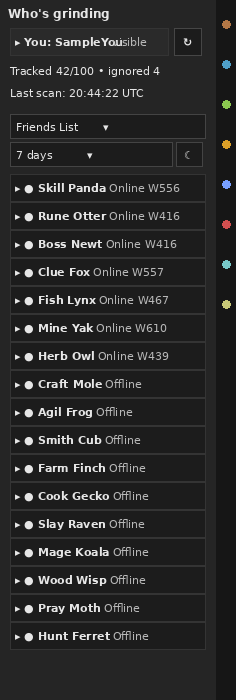
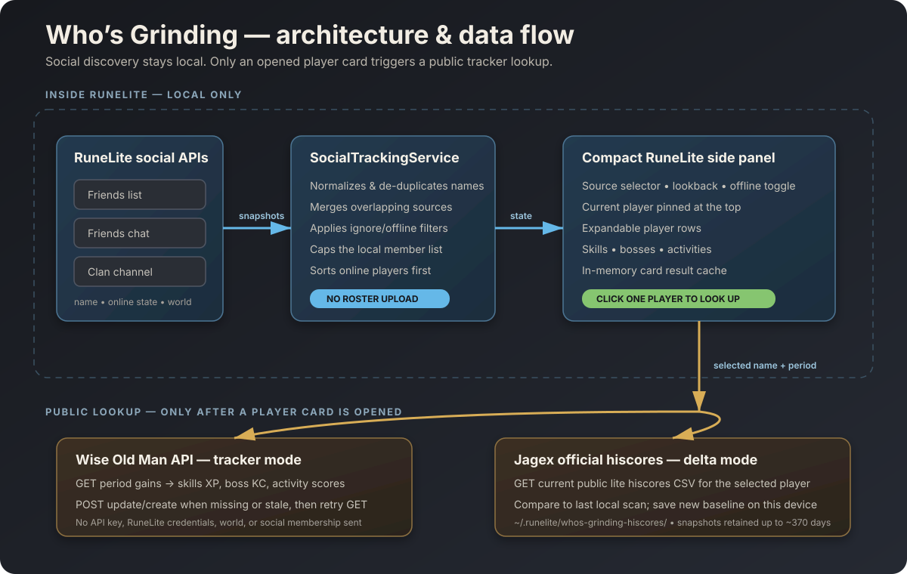

# Who’s Grinding Panel

<div align="center">


## See what the crew has been grinding—without leaving RuneLite.

**Friends, friends chat, and clanmates in one compact sidebar. Open a player to see XP gains, boss KC, and activity scores from Wise Old Man or your own official-hiscores scan history.**

[](https://runelite.net/plugin-hub/)
[](#local-development)
[](#build-and-test)
[](#privacy-and-network-usage)

</div>

Who’s Grinding Panel is a RuneLite external plugin for quickly answering one question:

> **What have my friends and clanmates actually been doing?**

The plugin reads RuneLite’s local social sources, combines duplicate players into one clean list, and renders it at the normal sidebar width. Opening a player card performs an on-demand public lookup and groups every positive result into **Skills**, **Bosses**, and **Activities**.

It does not upload your friends list, clan roster, worlds, credentials, or account session. Only the name of the player card you open—and the selected period when using Wise Old Man—is sent to the selected public service.

## Screenshots

### Social sources in one compact panel



The current account stays pinned at the top. Switch between **Friends Chat**, **Friends List**, and **Clan Chat**, choose a lookback period, include or hide offline friends, and refresh without leaving the panel.

## Features

- Discovers players directly from RuneLite’s local:
  - Friends list
  - Friends chat
  - Clan channel
- Merges the same player across multiple sources instead of showing duplicates.
- Displays online/offline state and world where RuneLite exposes it.
- Keeps the current account available at the top of every source view.
- Supports Day, 7-day, 30-day, and 365-day tracker windows.
- Expands players inline—no oversized second window or horizontal layout.
- Shows **all positive gains**, grouped into:
  - **Skills** — XP gained
  - **Bosses** — KC gained
  - **Activities** — score or minigame gains
- Cleans common tracker labels into familiar OSRS names such as `CoX`, `ToA`, `ToB`, `CG`, `LMS`, and `GotR`.
- Supports two deliberately different gain models:
  - Wise Old Man period gains
  - Official hiscores deltas since the plugin’s previous local scan
- Performs lookups only when a player card is opened and its result is not already cached.
- Rescans enabled RuneLite social sources on startup, login, configuration change, manual refresh, and the configured interval.

## Architecture



### Data flow

1. `WhosGrindingClanPanelPlugin` reads enabled social sources through RuneLite’s client API.
2. Each source becomes a local `SocialSourceSnapshot` containing player name, status, world, and source label.
3. `SocialTrackingService` normalizes names, merges duplicate identities, applies ignore/offline rules, enforces the configured cap, and sorts online players first.
4. `WhosGrindingClanPanelPanel` renders the local state in RuneLite’s sidebar.
5. Opening one player card chooses the configured gain client:
   - `WiseOldManGainedClient` for true day/week/month/year tracker gains.
   - `OfficialHiscoresGainedClient` for differences from the last scan stored on this device.
6. The lookup runs in a background worker. The result is formatted, cached in memory for that player/period/source, and returned to the expanded card.

Social discovery and gain lookup are intentionally separate. Seeing someone in the list does **not** trigger a web request.

## What APIs does it call?

### RuneLite Client API — local integration

These are local client calls, not requests to a third-party server.

| RuneLite API | Data read | Purpose |
| --- | --- | --- |
| `Client#getFriendContainer()` | Friend names and worlds | Build the Friends List source; optionally include offline friends. |
| `Client#getFriendsChatManager()` | Friends-chat member names and worlds | Build the Friends Chat source. |
| `Client#getClanChannel()` | Clan-channel member names and worlds | Build the Clan Chat source. |
| `Client#getLocalPlayer()` | Current display name | Pin the current account at the top. |
| `Client#getGameState()` and RuneLite events | Login/tick/config lifecycle | Trigger local rescans and the optional login hint. |
| `ClientToolbar` / `NavigationButton` | RuneLite sidebar integration | Register the approved plugin icon and compact panel. |
| `ConfigManager` | Plugin settings | Persist the panel lookback and offline-friend toggle locally. |

The plugin never reads bank contents, inventory contents, equipment, chat messages, passwords, Jagex account tokens, or RuneLite credentials.

### Wise Old Man API — tracker mode

Primary endpoint:

```http
GET https://api.wiseoldman.net/v2/players/{url-encoded-name}/gained?period={day|week|month|year}
```

If WOM does not have useful current data for the selected player, the plugin requests a public tracker create/update and retries:

```http
POST https://api.wiseoldman.net/v2/players/{url-encoded-name}
```

The POST has no request body. Requests use the user agent `WhosGrindingPanel RuneLite plugin`, a 3.5-second connection timeout, and a 5-second read timeout.

| Panel lookback | WOM period |
| --- | --- |
| Day | `day` |
| 7 days | `week` |
| 30 days | `month` |
| 365 days | `year` |

Returned public data is parsed into positive skill XP, boss KC, and activity-score gains. All positive entries are shown, largest first within each section.

### Jagex official hiscores — local-delta mode

```http
GET https://secure.runescape.com/m=hiscore_oldschool/index_lite.ws?player={url-encoded-name}
```

The official lite endpoint exposes current totals—not historical day/week/month/year gains. The plugin therefore calculates:

```text
current official hiscores total
− previous official hiscores total saved by this plugin
= change since the previous local scan
```

The first successful scan establishes a baseline. Later scans can show positive XP, KC, and activity differences. These values are always labeled as **difference since last plugin scan**, never as a WOM period.

Local baselines are stored at:

```text
~/.runelite/whos-grinding-hiscores/{normalized-player-name}.csv
```

Snapshots older than approximately 370 days are removed when the file is rewritten. This data stays on the player’s computer.

### Browser links—not background API calls

Player cards can construct links to public Wise Old Man, TempleOSRS, and official Jagex hiscore pages. Opening one uses the browser. TempleOSRS and Crystal Math Labs are **not** called by the current plugin API clients.

## Gain-source behavior

| Mode | Meaning | Remote request | Local storage |
| --- | --- | --- | --- |
| **Tracker APIs (WOM)** | True WOM day/week/month/year gains | Selected player name + selected period | In-memory card cache only |
| **Official Hiscores delta** | Change since this plugin last scanned that player | Selected player name | Versioned CSV baseline under `.runelite` |

The plugin does not silently present official scan-to-scan differences as weekly or monthly tracker history.

## Configuration

### Controls in the sidebar

- **Source:** Friends Chat, Friends List, or Clan Chat.
- **Lookback:** Day, 7 days, 30 days, or 365 days.
- **Offline:** include or immediately hide offline Friends List rows.
- **Refresh (`↻`):** rescan social sources and clear cached card summaries.

### RuneLite configuration

- **Show login hint:** show or suppress the startup chat message.
- **Activity window (minutes):** wording used by the login summary.
- **Max players shown:** cap used by summary/display behavior.
- **Track friends list:** enable local Friends List discovery.
- **Track friends chat:** enable local Friends Chat discovery.
- **Track clan chat:** enable local Clan Channel discovery.
- **Max tracked members:** cap local tracking state for memory and API control.
- **Refresh interval (minutes):** frequency of automatic local social rescans while logged in.
- **Gain data source:** select WOM tracker gains or official hiscores local deltas.
- **Enable WOM lookups:** when enabled, opening a card in tracker mode sends that selected player name to `wiseoldman.net`.

The lookback and offline controls are stored through RuneLite configuration but intentionally live in the panel because they are frequent actions.

## Privacy and network usage

### What can leave RuneLite

Only after a player card is opened:

- The selected player’s URL-encoded display name.
- The selected WOM period when WOM mode is active.
- Standard HTTP metadata such as the user agent and source IP inherent to contacting a public web service.

### What does not leave RuneLite

- Complete friends lists, friends-chat lists, or clan rosters.
- Membership source or social relationship.
- Player worlds from the social panel.
- RuneLite or Jagex credentials, cookies, or authentication tokens.
- Chat messages, bank, inventory, equipment, or local configuration contents.
- Analytics, advertising identifiers, crash reports, or custom telemetry.

There is no custom backend, account system, API key, or plugin-operated database. WOM results are cached only in memory. Official baseline files remain local.

## Failure handling

- API work is performed away from the sidebar rendering path.
- Connection and read timeouts prevent indefinite web requests.
- WOM HTTP failures return an availability message instead of freezing the panel.
- Users can explicitly choose official hiscores delta mode; WOM and official-delta semantics are not mixed.
- A first official scan creates a local baseline instead of claiming historical gains it cannot prove.
- Malformed official hiscore rows are skipped without discarding every valid row.
- Social sources that are disabled or not yet available display a clear local state.

## Project layout

```text
src/main/java/com/itmeansbigmountain/whosgrindingclanpanel/
├── WhosGrindingClanPanelPlugin.java    RuneLite lifecycle, social scans, toolbar
├── WhosGrindingClanPanelPanel.java     Compact sidebar and expandable cards
├── WhosGrindingClanPanelConfig.java    RuneLite configuration
├── SocialTrackingService.java          Local merge, filter, cap, and sorting
├── WiseOldManGainedClient.java         WOM period-gain requests and formatting
├── OfficialHiscoresGainedClient.java   Official scan baselines and deltas
├── GainsPeriod.java                    Panel-to-WOM period mapping
└── PlayerTrackingLinks.java            Safe public player-page URLs

src/test/java/com/itmeansbigmountain/whosgrindingclanpanel/
└── *Test.java                          UI dimensions, config, tracking, URLs,
                                        parsing, period mapping, and summaries
```

## Local development

Requirements:

- Java 11
- Included Gradle wrapper

Linux/macOS build:

```bash
export JAVA_HOME=/opt/data/jdks/current-java11
export PATH="$JAVA_HOME/bin:$PATH"
./gradlew clean test assemble --no-daemon --console=plain
```

Windows build:

```bat
gradlew.bat clean test assemble --no-daemon --console=plain
```

Launch RuneLite in developer mode:

```bat
gradlew.bat run --no-daemon --console=plain
```

Errors-only Windows console:

```bat
gradlew.bat run --no-daemon --console=plain --quiet 1>NUL
```

## Manual RuneLite testing checklist

1. Confirm `Who’s Grinding Panel` appears and enables without startup errors.
2. Confirm the unique navigation icon opens a panel within RuneLite’s standard sidebar width.
3. Verify Friends List, Friends Chat, and Clan Chat show the correct local members or a clear unavailable state.
4. Confirm the current account is pinned at the top for every source.
5. Toggle offline friends on and off; hidden offline rows must disappear immediately.
6. Open and close a player row; only the opened player should trigger a gain request.
7. Verify WOM mode shows every positive skill, boss, and activity gain for each period.
8. Verify a missing/stale WOM player follows update/create → retry without freezing RuneLite.
9. Verify official mode labels its first scan as a baseline and later scans as differences since the previous plugin scan.
10. Switch source, period, and data-source controls; cards must refresh with the correct semantics.
11. Confirm long gain lists remain vertical and readable without horizontal clipping.
12. Simulate an unavailable API and confirm the panel remains responsive with a useful status.
13. Confirm disabling WOM lookups prevents WOM card requests.

## Plugin Hub readiness

- Package: `com.itmeansbigmountain.whosgrindingclanpanel`
- Main class: `WhosGrindingClanPanelPlugin`
- Display name: `Who’s Grinding Panel`
- Java target: 11
- Build mode: standard
- Root and RuneLite navigation icons use the approved unique Who’s Grinding artwork.
- Third-party request purpose and transmitted data are documented here and in the WOM configuration description.
- No credentials, social roster, account session, analytics, or custom telemetry are transmitted.

## Support

Report a bug or request an improvement through the repository’s [GitHub issue tracker](https://github.com/ItMeansBigMountain/whos-grinding-clan-panel-osrs/issues).
